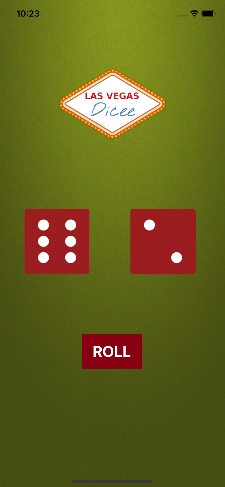

# Roll The Dice App

1.I have created a 'Rolling Dice' iOS Application which rolls down and shows a 'Random Die Number' upon clicking the "Roll" button. 
2.I did incorporate 'Random class' from Swift language which lets the die to pick a random number from the given array upon clicking the button.
3.You can either tap or shake the iPhone to let the die roll down

Here's a **Preview** of how the app will looks like when launched

